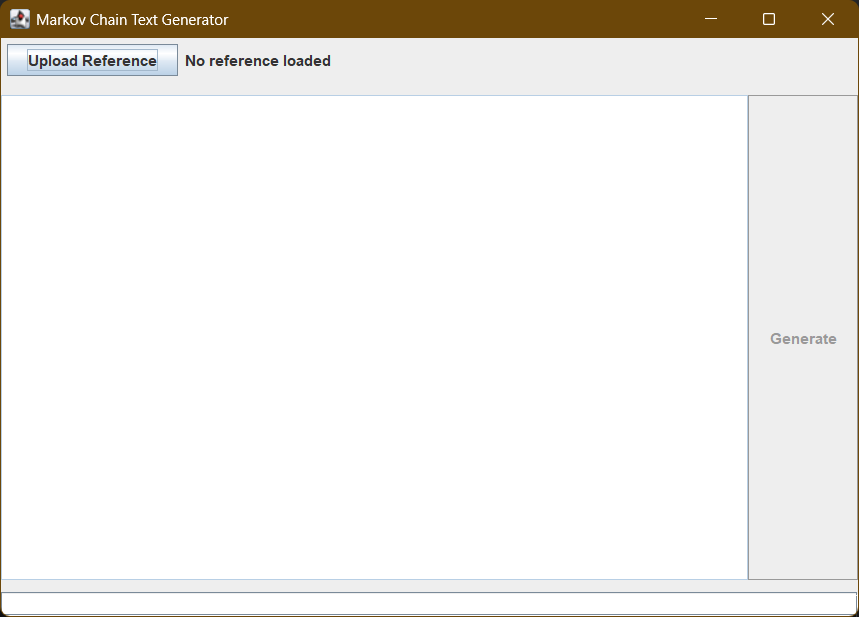

# Markov Language Model (Java)

## 📜 Overview
This project is a **Markov Chain-based language model** implemented in Java, designed to generate text using probabilities learned from an input `.txt` file.  
It reads a sample text, processes it into words, builds a Markov model in memory, and then generates text starting from a given seed word.  
The project includes a **graphical user interface (GUI)** to make it easy for users to interact with the model.

The **input file must be in plain `.txt` format** — no PDFs, DOCX, or other file types.

---

## ⚙ Features
- **Markov Chain Text Model**: Builds word-to-word probabilities based on the given text.
- **Unique Node Representation**: Each word is stored only once and connected to possible following words with transition probabilities.
- **Seed-based Generation**: The user chooses a starting word (seed) for text generation.
- **Graphical Interface**: Easy-to-use UI for loading text, training the model, and generating output.
- **In-Memory Model**: The current version builds the model from the text file each time it runs (no persistence yet).
- **Probability Calculation**: The likelihood of each possible next word is based on frequency in the source text.
- **Randomized Selection**: The generator can randomly choose the next word based on probabilities.

---

## 🖥 User Interface
The project includes a Swing-based UI (`MarkovUI.java`) with:
- **Text File Loader**: Lets you browse and select a `.txt` file as input.
- **Model Training Button**: Processes the file and builds the Markov chain.
- **Seed Word Input**: Field to enter the starting word for generation.
- **Generate Button**: Produces a sentence based on the model.
- **Output Display**: Shows the generated text in a scrollable text area.

---

## 📂 Project Structure
- `MarkovChain.java` — Core logic for storing and building the Markov model.
- `MarkovNode.java` — Represents a single word node in the chain with its possible transitions.
- `Connection.java` — Represents a directed connection (edge) from one word to another, with frequency and probability.
- `NonExistingNode.java` — Handles missing or invalid words in generation.
- `MarkovUI.java` — Swing-based graphical interface for user interaction.

---

## 📥 How to Use
### 1️⃣ Prepare Your Input File
- Create a `.txt` file containing your source text.
- Remove unnecessary formatting (PDF, DOCX, HTML are **not** supported).
## 🔍 Example

**Input Text:** The cat sat on the mat. The cat saw the dog.

**Possible Model:**

| Word | Next Words (Frequency) |
|------|------------------------|
| The  | cat: 2, mat: 1         |
| cat  | sat: 1, saw: 1         |
| sat  | on: 1                  |
| on   | the: 1                 |
| saw  | the: 1                 |
| dog  | _(no next words)_      |

**Generated Output (Seed = "The"):**

The cat saw the dog.

or

The cat sat on the mat.

